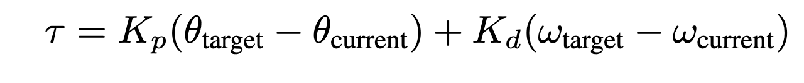

Lab 1 - Hello PD
================================
*Goal: Build two robot arms that mirror each other's motion.*

Step 0. Setup
^^^^^^^^^^^^^^
#. Install `VSCode <https://code.visualstudio.com/Download>`_
#. Install the PlatformIO extension for VSCode, a native Arduino/Teensyduino development IDE for VSCode. (Might take several minutes on Windows - check the bottom bar in VSCode for status)

.. raw:: html

    

        <iframe src="https://www.youtube.com/embed/LKH2Drp_evc" frameborder="0" allowfullscreen style="position: absolute; top: 0; left: 0; width: 100%; height: 100%;"></iframe>
    

|

Step 1. Assembly motor to base
^^^^^^^^^^^^^^^^^^^^^^^^^^^^^^^

.. raw:: html

    

        <iframe src="https://www.youtube.com/embed/S7Yns-jh8pE" frameborder="0" allowfullscreen style="position: absolute; top: 0; left: 0; width: 100%; height: 100%;"></iframe>
    

|

Step 2. Fasten feet to base
^^^^^^^^^^^^^^^^^^^^^^^^^^^^^^^^^^^^^^^^^^^^^^^^^^^^^^

.. raw:: html

    

        <iframe src="https://www.youtube.com/embed/StzPjM9KXO0" frameborder="0" allowfullscreen style="position: absolute; top: 0; left: 0; width: 100%; height: 100%;"></iframe>
    

|

* Ignore that there's a whole robot arm attached in the video.

Step 3. Attach dial to motor
^^^^^^^^^^^^^^^^^^^^^^^^^^^^^^^^^^^^^^^^^^^^^^^^^^^^^^

.. raw:: html

    

        <iframe src="https://www.youtube.com/embed/jO2BjMUmuZs" frameborder="0" allowfullscreen style="position: absolute; top: 0; left: 0; width: 100%; height: 100%;"></iframe>
    

|

Step 4. Connect and calibrate electronics
^^^^^^^^^^^^^^^^^^^^^^^^^^^^^^^^^^^^^^^^^^^^^^^^^^^^^^

**ELECTRONICS SAFETY:** Make sure to separate the PCB from the metal base before turning on the power, otherwise the circuit will short! Either elevate the PCB above the base with the screws provided, or place the PCB next to the metal base on the table.

.. raw:: html

    

        <iframe src="https://www.youtube.com/embed/r9CnXgrQnfI" frameborder="0" allowfullscreen style="position: absolute; top: 0; left: 0; width: 100%; height: 100%;"></iframe>
    

|

#. Turn on the system: press the power button on the PCB shield.
#. Calibrate: Press and hold the button on the C610 motor controller until the motor starts moving and release.
#. Wait until the C610 motor controller restarts.
#. Set ID: Click the button on the C610 controller, then a little while later (half second or so) press the button again. The light should flash green.
#. The light should now flash once every 2 seconds or so. The number of blinks indicates which ID it is. For example two blinks every 2 seconds indicates ID=2.

**Important:** *To set a motor controller to a certain ID, click (short press) press to put the motor controller into id-setting mode, then click N more times in quick succession, where N is the desired ID. Eg, for a desired ID of 3, press 3 more times after the first click.*

Step 5. Examine and run the starter code
^^^^^^^^^^^^^^^^^^^^^^^^^^^^^^

**WARNING** To stop code, press ``s`` inside the terminal instead of ^C. Using ^C will lead to undefined behavior when you upload new code, or run the code again. 

1. Git clone the `starter code <https://github.com/stanfordroboticsclub/independent-study-lab1>`_

``git clone https://github.com/cs123-stanford/lab_1_hello_pd.git``

``cd independent-study-lab1``

``git submodule init``

``git submodule update``

    Plug in USB Cable into Teensy like above

Open in VSCode, and upload to Teensy (refer to video).

.. raw:: html

    

        <iframe src="https://www.youtube.com/embed/WMEhVteT9h4" frameborder="0" allowfullscreen style="position: absolute; top: 0; left: 0; width: 100%; height: 100%;"></iframe>
    

#. Examine where in the code the motor angle and velocity are read in ``src/main.cpp``. Examine where the motor is commanded.

**NOTE** In Arduino/Teensyduino code, there are two central functions to pay attention to. First, there is the ``setup()`` function, which runs once when the code is uploaded to the microcontroller, and sets up the configuration. Next, there is the ``loop()`` function, which runs continuously, like a ``while True`` loop before you stop the code. Most other functions, while still important, can be considered helper functions. Pay particular attention to the ``updateCmd()`` and ``updateState()`` functions, which update a ``MotorState`` object that is defined in a struct. 

**DELIVERABLE: Before running your code, write what out what you understand about the ``loop()`` function for this code in your Lab Document. What gets updated on each iteration? How does updating a MotorState object correspond to actually changing the physical commanded current of the motor?**

    Click the alien icon in the left bar to open the PlatformIO menu. (The UPLOAD button uploads the code to the Teensy microcontroller. The MONITOR button allows you to see the output from the Teensy. UPLOAD AND MONITOR accomplishes both at once).  

#. Upload starter code to Teensy (right arrow icon in blue bar of VSCode or click the ant icon, then upload)
#. Open the serial monitor in VSCode (icon that looks like a plug in bottom bar of VSCode or click ant icon, then monitor)
#. Click into the serial monitor area and then press the key **s** to make the Teensy start printing out the angle and velocity of the connected motor.
#. Press ``s`` again to stop the program (use this in place of ^C, to start and stop the program). If you want to rerun the code, upload again or unplug and replug your computer from the Teensy.

.. figure:: ../../../_static/example-output.png
    :align: center
    
    Example output from serial monitor.

Step 6. Run bang-bang control
^^^^^^^^^^^^^^^^^^^^^^^^^^^^^^

#. Uncomment the bang-bang code in ``src/main.cpp`` and upload.
#. Observe the effects of changing the current command to something else.
#. *FEEL* how the controller behaves. Move the dial by hand and see how the controller reacts.

.. raw:: html

    

        <iframe src="https://www.youtube.com/embed/cskc04Jdz80" frameborder="0" allowfullscreen style="position: absolute; top: 0; left: 0; width: 100%; height: 100%;"></iframe>
    

*Example bang-bang control.*

**DELIVERABLE: Take a video of your bang bang control to upload to Gradescope with your submission**

Step 7. Write P proportional control
^^^^^^^^^^^^^^^^^^^^^^^^^^^^^^^^^^
#. Comment out the bang-bang controller. 
#. Take a look at the pd_control function in ``src/main.cpp``. Notice that there are two parts summed together: proportional_control and derivative_control. They are the individual terms of the PD control law. 
#. Complete the proportional_control function in ``src/main.cpp``. Your function should return an electrical current command (100mA, 200mA etc) using the PD control law using the following update equation. In this case, we are not conducting any damping on the control current, so leave that as 0. 

    
    PID Update Equation. ``Tau`` is the commanded electrical current for the motor, ``theta_target`` is the target angle, ``omega_target`` is the target angular velocity, ``theta_current`` is the motor angle, and ``omega_current`` is the motor angular velocity. ``Kd`` and ``Kp`` are the derivative and proportional gains - these are dimensionless coefficients that you will experimentally determine through trial and error. 

Questions:

#. Start with Kp = 1000.0 and leave Kd as is. Don't forget the negative signs! 
#. Upload code to Teensy
#. *FEEL* the effect of the P controller.
#. What happens when you rotate the disc just a little bit away from the target position? What happens when you rotate it a lot away from the target position? Do you feel the motor torque increase and then flatten out as you rotate the disc? 
#. Next, play around with different values for Kd. What, if anything, changes?

Step 8. Write PD position control
^^^^^^^^^^^^^^^^^^^^^^^^^^^^^^^^^^

#. Next, complete the derivative_control in ``src/main.cpp``. This should work with your proportional_control in pd_control to create a more full PD controller. Again, follow the above update equation, outputting an electrical current in ``tau``.

Questions:
#. Use Kp = 1000.0 and Kd = 10.0 to start. Don't forget the negative signs! 
#. Upload code to Teensy
#. *FEEL* the effect of the PD controller.
#. What happens when you rotate the disc just a little bit away from the target position? What happens when you rotate it a lot away from the target position? Do you feel the motor torque increase and then flatten out as you rotate the disc? 
#. Experiment around with different values of Kp and Kd. Report the Kp and Kd values that worked the best. 

**DELIVERABLE: Answer the above question in your lab document, and report your chosen Kp and Kd values. Take a video of your working PID controller to upload to Gradescope**

Step 9. Experiment with different parameters
^^^^^^^^^^^^^^^^^^^^^^^^^^^^^^^^^^^^^^^^^^^^^
Note: Some of these steps will cause the output disc to go unstable and violently shake, be prepared!

For each of these situations (except the ones that go unstable), rotate the disc around with your hand to get a physical sense for the PD behavior. Report on your findings for each of these in your lab document.

#. Keeping Kd constant (0), experiment with Kp = -100 and Kp = 5000. Discuss with your partner how each feels. Report how Kp and stiffness related?
#. Keeping Kp constant (1000), experiment with different Kd values from -10 to 1000. Report what happens.
#. Report what happens when Kp is too high. Try Kp=50000 and Kd=100.
#. Report what happens when Kd is too high. Try Kp=0 and Kd=100000.
#. Report what happens with just moderate damping. Try Kp=0 and Kd=100. 

**DELIVERABLE: Report your findings in your lab document**

The expected behavior is that higher Kp values will make the position control more stiff while higher Kd values will make the motor slower to achieve the desired position.
If either gain is too high or is negative, the motor will go unstable.

Step 10. Experiment with different loop rates
^^^^^^^^^^^^^^^^^^^^^^^^^^^^^^^^^^^^^^^^^^^^^

Report on your findings for each of these in your lab document
#. Examine where the code is checking if it's time to issue another control update.
#. Change the update rate to 4Hz with Kp=1000 and Kd=100 to observe instability. Reminder, 1Hz = 1/seconds. 

**DELIVERABLE: Report how increasing/decreasing the update frequency affects the controller's performance.**

**WARNING, decreasing the update frequency by too much can cause dangerous behavior.**

Step 11. Program periodic motion
^^^^^^^^^^^^^^^^^^^^^^^^^^^^^^^^^^^

1. Set the update rate back to 200Hz (5ms interval).
2. Program the motor to track a sinusoidal position, like the psuedocode below. 

.. code-block:: c++

    float time = millis() / 1000.0
    position_target = sin(time)

3. Play around with different frequencies. How high can you raise the frequency before the motor no longer moves as much as you expect? 

**DELIVERABLE: Take a video to upload to Gradescope with your submission**

Fun fact, the maximum frequency you can go before the motor moves to only 71% (-3dB) of the intended motion is called the bandwidth.

Congrats on finishing your first lab!
