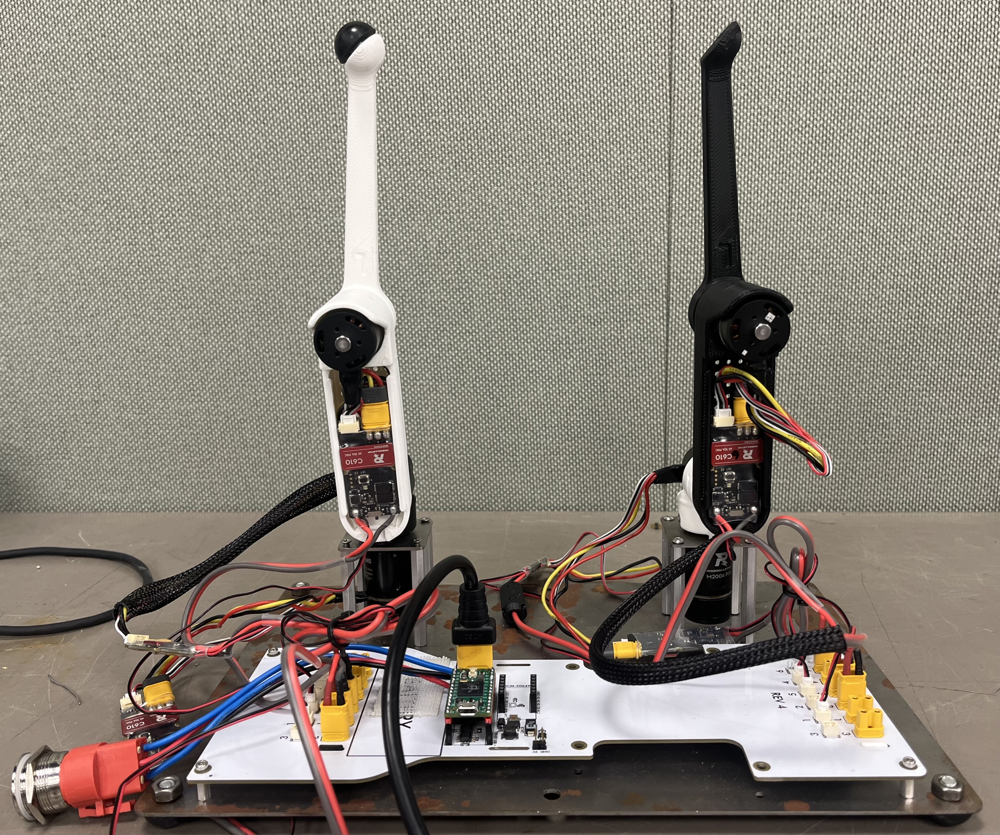
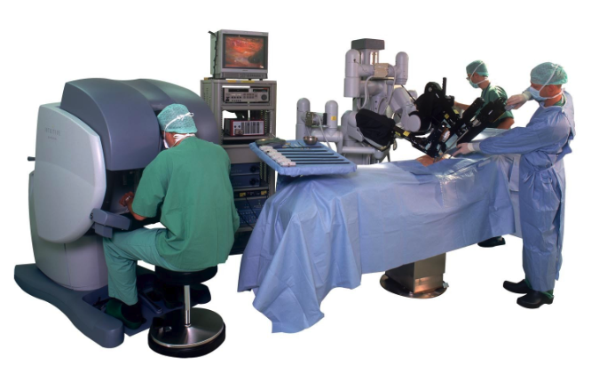
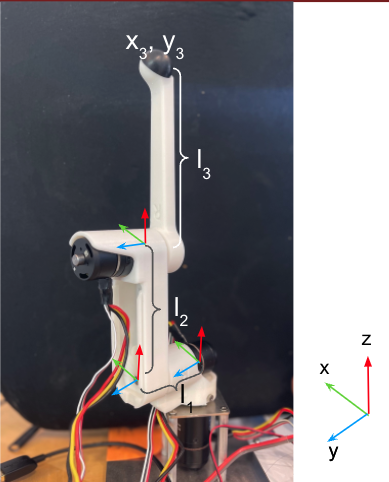

Lab 2: Bad Robot Surgeon
================================

`Lab 2 Document <https://docs.google.com/document/d/1mb8gAqws2CNTXpFKZXI0iVApD7mzUVjW-WSP1v8IuJY/edit>`_

`Lab 2 Review Slides <https://docs.google.com/presentation/d/10pnFP7l4NS_MODYVczwSuWUJI5dLRwf9/edit#slide=id.p1>`_

Part One: Bad Robot Surgeon
___________________________

*Goal: Build a control arm and a surgery arm using Pupper's legs with haptic feedback.

.. figure:: ../../../_static/teleop.jpeg
    :align: center
    
    Assembled teleop robot arms

Step 0. Clone the starter code 
^^^^^^^^^^^^^^^^^^^^^^^^^^^^^^^^^^^^^^^^^^^^

1. In the directory of your choice, git clone the `starter code <https://github.com/cs123-stanford/lab_2_bad_robot_surgeon.git>`_ for Bad Robot Surgeon

``git clone https://github.com/cs123-stanford/lab_2_bad_robot_surgeon.git``

``cd lab_2_bad_robot_surgeon``

``git submodule init``

``git submodule update``

Step 1. Connect 2 more motors
^^^^^^^^^^^^^^^^^^^^^^^^^^^^^^^^^^^^^^^^^^^^

#. Take off the plastic wrap on the motors. Connect power and encoder cables from motors to controllers.
#. Connect power (yellow cables) from the motor controllers to the Pupper PCB.
#. Set the new motor controllers to have different IDs. Use 1, 2, and 3. **Important:** *To set a motor controller to a certain ID, click (short press) press to put the motor controller into id-setting mode, then click N more times in quick succession, where N is the desired ID. Eg, for a desired ID of 3, press 3 more times after the first click. Unplug the CAN (small) cables from the PCB while setting ID's to make it easier, otherwise they may conflict while you are changing them*
#. Plug in the CAN Connectors (smaller, white) to the PCB corresponding to the correct bus. 

Step 1.5. Control the 3 motors together
^^^^^^^^^^^^^^^^^^^^^^^^^^^^^^^^^^^^^^^^^^^^

#. Update your PD control code with you lab 1 gains to control all 3 motors (controlled independently). Modify only the ``back_state`` MotorState array here to update the MotorState array for all 3 motors.

*When testing your code throughout this lab, initialize your arms as is in the above picture. Keep in mind the reference to the PCB.*

Step 2. Insert square nuts into plastic parts
^^^^^^^^^^^^^^^^^^^^^^^^^^^^^^^^^^^^^^^^^^^^^^^^^^^^^^

You may need to use force to get them in. The screw hole of the square nut must exactly align with the screw hole on each of the parts, as a long screw will attach through there. 

.. raw:: html

    

        <iframe src="https://www.youtube.com/embed/j0Hgfy8VNqU" frameborder="0" allowfullscreen style="position: absolute; top: 0; left: 0; width: 100%; height: 100%;"></iframe>
    

|

Step 3. Connect and calibrate electronics
^^^^^^^^^^^^^^^^^^^^^^^^^^^^^^^^^^^^^^^^^^^^^^^^^^^^^^

The motors should be calibrated in this way

.. figure:: ../../../_static/motor_ids.png
    :align: center
    
    Motor IDs: use 1-3 for the front leg, and 1-3 for the back leg. Both should be right-hand-sided legs

**IMPORTANT:** Calibrate each motor *before* you assemble the arm, so that they get an accurate calibration with no load. Once you calibrate the motor, keep it with the motor controller you calibrated it on. The calibration is dependent on the motor controller, so that motor is now paired with the motor controller. If in doubt, recalibrate.

.. raw:: html

    

        <iframe src="https://www.youtube.com/embed/x3uOnfIZGxg" frameborder="0" allowfullscreen style="position: absolute; top: 0; left: 0; width: 100%; height: 100%;"></iframe>
    

|

**DELIVERABLE: Take a video of the motor controllers blinking with the correct IDs as decribed above.**
This is just to ensure that the motors are calibrated and connected before building the full leg, or else reassembly would be necessary.

Step 4. Assemble the three motors into a right robot arm!
^^^^^^^^^^^^^^^^^^^^^^^^^^^^^^^^^^^^^^^^^^^^^^^^^^^^^^

**IMPORTANT**: Make sure you calibrated the motors before assembling the arm!

The robot arm we're making is actually one of Pupper's right legs so you'll see the instructional videos reference it as such.

.. raw:: html

    

        <iframe src="https://www.youtube.com/embed/NqJmOAtKIpY" frameborder="0" allowfullscreen style="position: absolute; top: 0; left: 0; width: 100%; height: 100%;"></iframe>
    

    
|
**Assembly Pro Tips**

#. Use the tip of the hex driver to align the shoulder bolt with the square nut. This will make assembly much easier.
#. Make sure the wires on your motor are pointing the same direction as the arrow inside your joints.
#. Use force when inserting the shoulder bolts. Sometimes it is hard to get them through the hole in the motor shaft even if perfectly aligned.
#. Tighten the shoulder bolts as tight as possible without stripping. It is vital for the future stability of your Pupper!

|

Step 5. Run your code again on the new robot arm
^^^^^^^^^^^^^^^^^^^^^^^^^^^^^^^^^^^^^^^^^^^^^^^^^^^^^^

#. Note that the "zero" position of these motors is whatever position it was at when the Teensy and motor were first both powered on. When running your code, always make sure to initialize in the vertical position with the correct reference to the PCB as in the above image.
#. Upload and run your code for controlling the 3 motors simultaneously.

.. raw:: html

    

        <iframe src="https://www.youtube.com/embed/SVwILVoCzxM" frameborder="0" allowfullscreen style="position: absolute; top: 0; left: 0; width: 100%; height: 100%;"></iframe>
    

*Example where the arm PID positions targets are set so that it stands up vertically.*

|

Step 6. Connect three more motors to use as control dials
^^^^^^^^^^^^^^^^^^^^^^^^^^^^^^^^^^^^^^^^^^^^^^^^^^^^^^^^^^^^^^^^^^^^^^^^^^^^^^^^^^^^^^^^^^^^^^^^^^^^^^^^^^^^
#. Connect three additional motors to the other CAN bus (ie different row of connectors).
#. Calibrate and connect three additional motors to the Pupper PCB.
#. Set their IDs to 1, 2, and 3. There should be no conflicts (ID conflicts beep and flash yellow) as they are attach to a different CAN bus. If you do have an ID conflict, you must remove the CAN connector (smaller white) from the PCB, and then reset the motor IDs. 
#. Set the target positions of the base motor, shoulder motor, and elbow motor to the angle readings of the first, second, and third new motors respectively. Use the ``front_state`` MotorState array for this. 

[TODO: gif]

Step 7. Connect and calibrate electronics for second right robot arm
^^^^^^^^^^^^^^^^^^^^^^^^^^^^^^^^^^^^^^^^^^^^^^^^^^^^^^^^^^^^^^^^^^^^^^^^^^^^^^^^^^^^^^^^^^^^^^^^^^^^^^^^^^^^^^^^

Make sure that both arms are right-hand-sided (3d printed parts are marked with R and L)

.. raw:: html

    

        <iframe src="https://www.youtube.com/embed/o22KU2hMFEw" frameborder="0" allowfullscreen style="position: absolute; top: 0; left: 0; width: 100%; height: 100%;"></iframe>
    

|

Step 8. Assemble the three new motors into a robot arm
^^^^^^^^^^^^^^^^^^^^^^^^^^^^^^^^^^^^^^^^^^^^^^^^^^^^^^^^
We are now assembling another one of Pupper's legs to use as a second arm!

.. raw:: html

    

        <iframe src="https://www.youtube.com/embed/Eq8ORlPMOAw" frameborder="0" allowfullscreen style="position: absolute; top: 0; left: 0; width: 100%; height: 100%;"></iframe>
    

Step 9. Use the arms as leader and follower.
^^^^^^^^^^^^^^^^^^^^^^^^^^^^^^^^^^^^^^^^^^^^^
#. Use the same code as in Step 6 where one set of motors controllers the other.
#. Start the robot arms from the same position.
#. Tune Kp and Kd gains and maximum current as you like.

**DELIVERABLE: Submit a video of your leader/follower setup where you move all 3 joints of the leader, showing the follower copying the movements. Report on the differences you noticed between tuning the multi-joint setup versus the single dial setup in your lab document**

[TODO: pic]

Step 10. Make the robot arms bidirectional!
^^^^^^^^^^^^^^^^^^^^^^^^^^^^^^^^^^^^^^^^^^^^^
#. Program position control for the leader arm actuators (formerly control dial actuators)
#. Set the position targets of the leader arm to the positions of the follower arm.
#. Send current (ie torque) commands to the robot arms with the code . Refer to the motor ID diagram to control the correct motors. They shold both be right legs.

.. code-block:: c++

    bus_back.CommandTorques(back_state[0].cmd, back_state[1].cmd, back_state[2].cmd, 0 , C610Subbus::kIDZeroToThree);
    bus_front.CommandTorques(front_state[0].cmd, front_state[1].cmd, front_state[2].cmd, 0 , C610Subbus::kIDZeroToThree);

**DELIVERABLE: Submit a video like the leader/follower video where you move both arms manually, first moving the front, and then the back, to show bidirectionality**

[TODO: gif]

Part Two: Forward Kinematics
__________________________________

Inspiration: Robot Surgery

    
    Da Vinci robot built by Intuitive Surgical. A trained doctor manipulates the arms of the Da Vinci robot for a minimally invasive surgery.

#. For this lab, we are going to be building a bad robot surgeon using some of Pupper's legs. Much like the Da Vinci surgical robot, we are going to control one of Pupper's arms as the controller joystick, and the other arm will copy the first arm's movement. When the surgery arm is touching something that it should not, we will use haptic feedback on the control arm to tell the user that something is wrong. We will use forward kinematics to do this!

Step 11. Implement and test a forward kinematics function
^^^^^^^^^^^^^^^^^^^^^^^^^^^^^^^^^^^^^^^^^^^^^^^^^^^^^^^^^
#. Complete the forward_kinematics function inside of src/kinematics.h using what you learned in lecture. You should return a BLA::Matrix<3> of the cartesian coordinates of the end-effector.

Here is some syntax for BLA Matricies in C++
.. code-block:: c++

    BLA::Matrix<4, 1> matrix = {0, 1, 0, 0};
    BLA::Matrix<4, 4> mat = {1, 0, 0, ,
                          0, 1, 0, 0,
                          0, 0, 1, 0,
                          0, 0, 0, 1};

#. IMPORTANT: Initialize the arm in an upright position, as shown in step 1.5. If it is initialized incorrectly, your forward kinematic solution will appear incorrect.
#. Upload code.
#. Press s to start. The starter code will first test your kinematics code and then run the main loop. If you are failing asserts, check to see which assert you are failing. These tests are detailed in the src/test_kinematics.h file. 

    
    A robot arm in the starting position for lab 2 and its coordinate system. Remind yourself of the coordinate system at each step, and keep in mind the references that each motor has to each other motor. 

**DELIVERABLE: Answer in your lab document. Did you forward kinematics code pass the asserts the first try? What changes did you make to pass the asserts? What debugging techniques did you use?**

Step 12. View cartesian coordinates of end effector
^^^^^^^^^^^^^^^^^^^^^^^^^^^^^^^^^^^^^^^^^^^^^^^^^^^
#. Uncomment code block labelled "PART TWO: Forward Kinematics". This block will call the forward kinematics function you just implemented for you, and print out the cartesian coordinates in the Serial Monitor.
#. Check to see that your forward kinematics function is working correctly according to the right hand rule.

Step 13. Make a safety box
^^^^^^^^^^^^^^^^^^^^^^^^^^^^^^^^^^^^^^^^^^^^^^^^^^^
#. Decide which arm you plan to use for the control arm, and which arm you use for the surgery arm (either the bus_back or bus_front arm). 
#. Pick a "safety" box -- a virtual box in cartesian coordinates that the robot can operate safely in (i.e. not touching an organ in the body). For example, -0.1<x<0.1 and -.1<y>0.1 and 0<z<-0.2.
#. Print a warning whenever the robot leaves the safety box. 

**DELIVERABLE: Submit a video of you moving the robot arm outside of the safety bounds, and the serial monitor output printing an outside bounds message**

Step 14. Do the `safety dance <https://www.youtube.com/watch?v=nM4okRvCg2g&ab_channel=MenWithoutHatsVEVO>`_
^^^^^^^^^^^^^^^^^^^^^^^^^^^^^^^^^^^^^^^^^^^^^^^^^^^^^^^^^^^^^^^
#. Make a function to vibrate the motors of the control arm (high frequency, low amplitude alternating torque command) using the bus.CommandTorques() function. 
#. A safe range for the amplitude is around 800 - 3000mA. Any lower is barely perceptible.
#. Run the function whenever the surgery arm end effector leaves the safety box. A suggested implementation is to alternate the torque current command on each control loop iteration using the bus.CommandTorques() function. This alternating torque will serve as the haptic feedback for when the user moves the control arm outside safe bounds.

**DELIVERABLE: Submit a video of you moving the robot arm outside of the safety bounds, and the arm's haptic feedback response. Report what amplitude you chose for the haptic feedback.**
