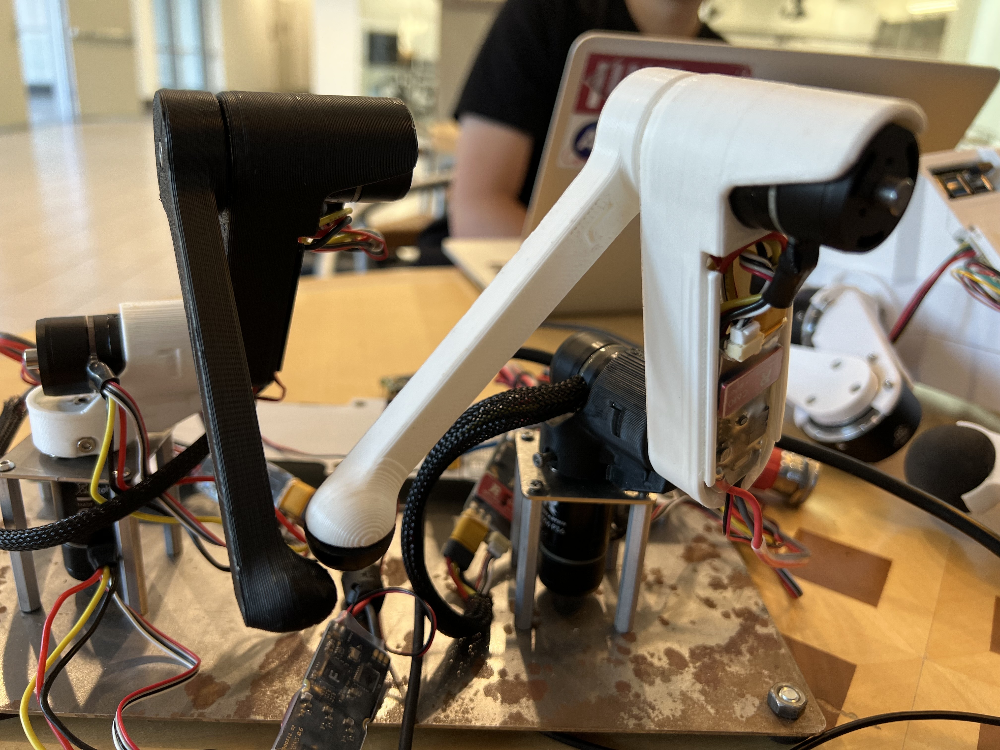

Lab 3: Romeo and Juliet
=======================================================

**Goals:**
        1. Learn how to compute inverse kinematics 
        2. Use FK+IK to create a mirroring setup

Step 1. Code inverse kinematics
^^^^^^^^^^^^^^^^^^^^^^^^^^^^^^^^^^^^^^^^^^^^
#. Download starter code from here: https://github.com/cs123-stanford/lab_3_romeo_and_juliet.git and fill out deliverables in [template doc here](https://docs.google.com/document/d/1eVlykTsy5krLiFD5Apgt6rBzp-t0tfXLXmJ1NIIOQTQ/edit?usp=sharing)
#. Implement ``distance`` in ``kinematics.h`` as the squared-norm of the error between the position returned by ``FK(guess)`` and ``target_location``. 
#. Implement ``calculate_gradient`` in ``kinematics.h``
#. Implement ``inverse_kinematics`` in ``kinematics.h``

Step 2. Test the consistency between forward kinematics and inverse kinematics
^^^^^^^^^^^^^^^^^^^^^^^^^^^^^^^^^^^^^^^^^^^^^^^^^^^^^^^^^^^^^^^^^^^^^^^^^^^^^^^^^^^^^^^^
#. Look at the tests written for you in ``test_ik`` within ``test_inv_kinematics.h``
#. The test works by taking some reachable (x,y,z) point in space, and calling your IK function to get the corresponding joint angles, then passing them to your FK function to retrieve the original (x,yz).
#. Make sure the test passes before moving on

**Deliverable: Write about why we are doing an IK -> FK consistency test rather than an FK -> IK test (2-3 sentences). Hint: Think about the robot leg configuration(s)**

**Deliverable: Why is it important that the point we are testing is reachable? Describe what you expect IK to return for this case?**

Step 4. Put it together! Make your two robot arms match each other's end-effector positions
^^^^^^^^^^^^^^^^^^^^^^^^^^^^^^^^^^^^^^^^^^^^
1. Implement the rest of ``loop()`` in ``main.cpp`` and deploy on the robot

**Deliverable: Send a video of the arms roughly matching each other when you move them**

2. Try more iterations of IK in ``kinematics.h``, and observe the behavior **(Careful may be unstable)**

**Deliverable: Why does more iterations of IK cause instability?**
