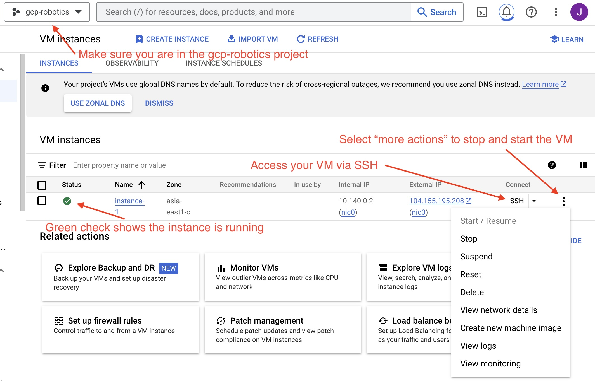
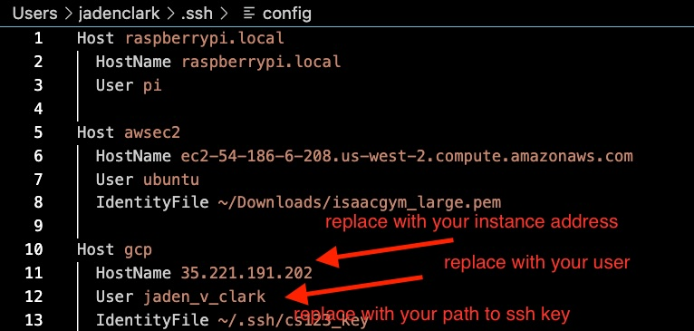

Lab 5: How to Train Your Dog
========================

`Lab document <https://docs.google.com/document/d/1JGY5c8KDmdC-akXE1jUoKW8Bshc-y2HM5WJQnYqEUtk/edit?usp=sharing>`_ 

*Goal: Use RL to control your Pupper.*

Step 1. Set Up Virtual Machine
^^^^^^^^^^^^^^^^^^^^^^^^^^^^^^^^^^^^^^^^

    Access your group's GCP instance

#. Log into GCP and find the gcp-robotics project
#. Start your machine, and SSH into the instance (using the 'ssh' button on the webpage shown in the image above)
#. Navigate to the directory "/home/jaden_v_clark/rl/cs123/leggedgym". Here, you will be able to run the train.py script to train a policy, and play.py script to run the latest policy.
#. In legged_gym run ``conda activate rlgpu``, then ``pip install -e .`` and ``export LD_LIBRARY_PATH=/opt/conda/envs/rlgpu/lib``
#. Test if all installations work by running ``python legged_gym/scripts/train.py --task=pupper_stand --num_envs=2000 --max_iterations=500 --run_name='standup_test' --headless`` to start training. If the policy beings training, then press Ctrl+C to cancel and continue. Talk to a TA if this does not work.
#. Also, make a note of the username shown in the ssh window (it should look something like USERNAME@instance). This will be used in generating SSH key in the steps below.

Step 2. VS Code SSH Setup
^^^^^^^^^^^^^^^^^^^^^^^^^^^^^^^^^^^^^^^^
.. youtube:: onKg1KtGWiE
   :width: 640
   :height: 480

#. Setup SSH key using `instructions <https://cloud.google.com/compute/docs/connect/create-ssh-keys>`_ 
#. Press return to not require a password when it prompts you
#. Once your ssh key is created run ``cat /path/to/key.pub`` and copy the full ssh key. The format should be ``ssh-rsa keyvalue user``.
#. Go to your instance, select edit, and add an SSH key.
#. Install the VS Code 'Remote - SSH' extension.
#. Press Cmd + Shift + P. Select "Connect to host". then "Configure SSH Hosts...". Open the ".../.ssh/config" file. Fill out GCP host config as shown in the image. The user is the  same as your Stanford user. For example, if your email is jvclark@stanford.edu, use jvclark.

    Setup SSH access

#. Press Cmd + Shift + P again. Then select "Connect to Host". Press Cmd + O to open the rl/legged_gym repository.
#. You should now be able to edit your code in the legged_gym repo.
#. IMPORTANT: If you turn your machine on and off, you will need to reset

Step 3. Setup Chrome Remote Desktop
^^^^^^^^^^^^^^^^^^^^^^^^^^^^^^^^^^^^^^^^

#. Go to https://remotedesktop.google.com/headless
#. Click 'Begin' -> 'Authorize' -> Copy the command below 'Debian Linux' (the one that starts with ``switch-graphical-session``)
#. In the SSH window from Step 1, pase and execute the copied command.
#. For the 6-digit passcode you can just use something like '123456'.
#. Go to https://remotedesktop.corp.google.com/access, you should see the GCP instance you just setup appear in the device list. Now you can click it to see the remote desktop.
#. Once in the remote desktop, activate copy and paste by opening a terminal and running ``sudo apt-get install gnome-terminal``. Then right click to copy and paste.

**Note:** for the RL training part of this lab, you will use the VS Code setup to edit the code, and then use the chrome remote desktop to run the command and visualize the policy. Remember to enter the necessary conda env with ``conda activate rlgpu`` before running any training code.

Step 4. Stand High Policy
^^^^^^^^^^^^^^^^^^^^^^^^^^^^^^^^^^^^^^^^

Navigate to the starter code.
-------------------------------

IMPORTANT: Your workflow for this lab should be coding in VS code, and running and visualizing policies in the chrome remote desktop. To run a policy in chrome desktop, just open a terminal and navigate to the correct directory to run the play and train scripts.

In the Chrome Remote Desktop window from Step 3, start a new terminal.

Access the starter code using ``cd/home/jaden_v_clark/rl/legged_gym``

Switch to the correct branch using ``git checkout class``

Run ``export LD_LIBRARY_PATH=/opt/conda/envs/rlgpu/lib`` and ``conda activate rlgpu`` to enter the conda environment.

Run training with skeleton code ``python legged_gym/scripts/train.py --task=pupper_stand --num_envs=2000 --max_iterations=500 --run_name='standup_test'`` 

You should see a screen showing up with many robots and they start to move their legs a bit. On the terminal, you should see training logs with reward being zero (since we haven't added the reward yet).

Implement first version of standing up policy
-------------------------------

IMPORTANT DEBUGGING ADVICE: It may be challenging at first to compose the correct tensor operations. To debug, please use pdb by adding ``breakpoint()`` in your reward functions and analyzing dimensions of key variables. Refer to the slides handout for common pdb operations.

In VS Code, navigate to ``legged_gym/envs/pupper/pupper.py``.

Your job is to edit the ``_reward_base_height`` function so that Puppper stands up.

A key robot state you will be using in this task is the height of the robot's body. You can access that using ``self.root_states[:, 2].unsqueeze(1) - self.measured_heights``. Remember, we are using a parallel simulation that simulates many robots at the same time, so the height variable you get will be of shape [N, 1], where N is the number of robots being simulated.

Now we want to make the robot stand up from a sitting pose, a straightfoward way is to make the height of the robot large, right? Let's give it a try by defining a reward function of: 

$r(x) = x_2$

where $x$ is the state of the robot, and $x_2$ means we are taking the second dimension of it (height). So this is saying: the higher the body is, the more reward robot will get.

After you finish coding the reward, use the same command as above: ``python legged_gym/scripts/train.py --task=pupper_stand --num_envs=2000 --max_iterations=500 --run_name='standup_test' `` to run the training. This time you should see remove being non-zero.

To check the policy, visualize by running ``python legged_gym/scripts/play.py --task=pupper_stand`` in a new terminal every 100 or so iterations. This will save a video in the folder logs/pupper_stand_exported/frames, which you can right-click and download onto your local machine for viewing.

You can also analyze learning curves using tensorboard. To do so, open a terminal on your local machine and run ``ssh -i /path/to/sshkey -L 6006:localhost:6006 username@puplicip``. This opens port forwarding through 6006. Then navigate to the legged gym repo and run ``tensorboard --logdir logs``. Copy the suggested URL from the terminal and paste into a browser on your local machine to visualize learning curves.

In a successful first standup policy, Pupper should be standing up and staionary off the ground. Don't worry if Pupper falls over or this policy is imperfect.

**DELIVERABLE**: Saved vido of simulation training result.

**QUESTION**: What robot behavior do you observe? Why is the robot behaving this way?

Implement second version of standing up policy
-------------------------------

Let's now try to make the robot stand at a certain height that we specifies. The desired base height is defined in ``self.cfg.rewards.base_height_target`` in the code.

To make the robot go to certain height, a plausible idea is to penalize how different the current height of the robot is from the desired height, i.e. using a reward function of:

$r(x) = -(x_2 - target)^2$

Now go ahead and revise your ``_reward_base_height`` and run training again.

Similar to the last step, view your policy with play.py while training. This policy should stand up and be stable after around 200-300 iterations.

**DELIVERABLE**: Screen recording of simulation training result.

**QUESTION**: What robot behavior do you observe? Why is the robot behaving this way? 

Step 5. Deploy Stand High Policy
^^^^^^^^^^^^^^^^^^^^^^^^^^^^^^^^^^^^^^^^
Transfer policy from virtual machine to local machine

#. Clone the puppersim repo onto your **local** machine using ``git clone https://github.com/jadenvc/puppersim.git``. This repository contains policy deployment code for transferring the policy trained in simulation to the phsyical hardware. Swith to the branch "jaden" using git checkout ``jaden``.
#. Navigate inside the puppersim repo and run ``pip install -e .`` Don't forget the "." at the end.
#. Move your file into the puppersim repo. You can find the policy you just trained in the logs folder of  ``legged_gym`` in VS code, and download it to your  ``puppersim`` directory on your local machine.
#. In local puppersim repo, change the policy called in isaac_gym_policy.py (located under the puppersim folder) to your policy name (your .pt file)
#. Turn on and calibrate Pupper. 
#. Connect the Ethernet cable from your computer to Pupper
#. run your policy on Pupper using ``./deploy_to_robot.sh python puppersim/puppersim/isaac_gym_policy.py --run_on_robot``. Make sure you are aware of the cables in advance and are prepared for Pupper to behave unexpectedly.

**DELIVERABLE**: Video of stand-up in real
    

Step 6. Walking Policy
^^^^^^^^^^^^^^^^^^^^^^^^^^^^^^^^^^^^^^^^

Now let's make the Pupper walk! To do that, you need to write the  ``_reward_forward_velocity`` and ``_reward_torques`` functions in ``pupper.py`` so that Pupper receives a positive reward for moving forward.

Of course you would need to access how fast the robot is moving currently. To do that you can use the ``self.root_states`` variable. Note that this is a matrix of [N, 13] (N is number of robots being simulated, which sould be 2000).  

For the 13 dimensions, we have:

0-3: position of robot, 

3-7: orientation of robot (in quaternion), 

7-10: linear velocity of robot, 

10-13: angular velocity of robot.

For example, to capture the forward linear velocity of all robots use ``self.root_states[:,8]``.

Your task here is to propose **THREE** ideas of writing a reward function that would make the pupper walk forward as elegantly as possible, and obtain suggestions/approval from TA before implementing it in the code.

For running training in this task, use the following command:
``python legged_gym/scripts/train.py --task=pupper_flat --num_envs=2000 --max_iterations=1500 --run_name='running_test' `` 
to train your policy. Check policy around every 250 iterations to analyze if you have chosen the correct coefficients.

Experiment with different reward coefficents in ``pupper_config`` until you are happy with the walking gait.

Deploy policy on Pupper, as in Step 5. Be careful as the robot may behave erratically.

**DELIVERABLE**: Why is the torque reward important? Why is torque penalized?

**DELIVERABLE**: Videos of sim and real robots with trained policies. Also please submit your tensorboard mean reward plot for the successful policy.

**DELIVERABLE**: What terms are included in your reward functions? What coefficeints did you use? How did you come up with these terms and what was their desired effect? Why might this policy perform poorly on the physical robot?

**DELIVERABLE**: How did the performance in simulation compare to the performance on the physical robot? What about hte simluation might not be accurate to the real world?

Step 7. Domain Randomization
^^^^^^^^^^^^^^^^^^^^^^^^^^^^^^^^^^^^^^^^^^^^^^^^^^^^^^^^^^^^

Domain Randomization is a common technique to help simulation-trained robots to better work in the real-world. The core insight behind Domain Randomization is that a policy that can handle a large diverse set of simulation environments is more likely to succeed in the real-world.

Now in order to create this large diverse set of simulation environments, we need to sample random parameters for our simulation during the training. The starter code has already done the infrastructure work to setup the randomization mechanism, and your job is to identify a good set of parameters to be randomized and their ranges.

In in ``pupper_config.py``, edit the ``domain_rand`` ranges. Experiment with different ranges until Pupper has similar performance in the real world, to in simulation.

In addition, implement the torque penalization reward, which would make the robot motion safer and smoother. You can get access to the motor torque by ``self.torques``.

**DELIVERABLE**: Simulation and real videos of policies trained with domain randomization.

**DELIVERABLE**: For 3 different terms that you randomized, what ranges or values did you select, and how did you choose them?

**DELIVERABLE**: How did the randomization impact the result of training and deployment to real?

Step 8. Speed test (Bonus)
^^^^^^^^^^^^^^^^^^^^^^^^^^^^^^^^^^^^^^^^^^^^^^^^^^^^^^^^^^^^

Now let's challenge our selves a bit in trying to train the pupper to run as fast as possible!

#. Tune your reward function and domain randomization to improve Pupper's speed. You can use any reward function defined in legged_robot.py, or add your own.
#. Fastest Puppers will get extra credit!

**DELIVERABLE**: Test your policy during office hours

Resources
-----------
`Legged Gym Paper <https://arxiv.org/pdf/2109.11978.pdf>`_

`Learning Quadrupedal Locomotion Over Challenging Terrain <https://arxiv.org/abs/2010.11251>`_
