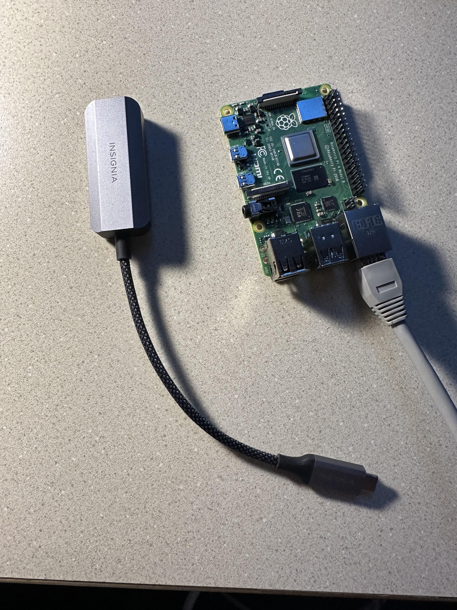

Lab 7: Do What I Say
========================

Now we are ready to do some cool things! With the fully built Pupper, we are going to use LLMs to control the robot to do new tasks that we can come up with, making new movements faster than we could have imagined!

`Lab Document <https://docs.google.com/document/d/1QEGYznZovdQ-JiNtLgiRd0G3alqqqAifYUD2NQlMEHo/edit?usp=sharing>`_ 

`Lab Review Slides <https://docs.google.com/presentation/d/1sjY9XK81GSq5iTafxziCz354rBoAEb1O/edit?usp=sharing&ouid=112164671976474020631&rtpof=true&sd=true>`_ 

**Goals:**
        1. Use LLMs to program Pupper to perform new tasks on the fly.
        2. Experiment on how LLMs perform with high level and low level control on Pupper. 
        3. Use prompt engineering for an open-ended mini project!

.. youtube:: NyxzC4KVDoc
   :width: 640
   :height: 480

Step 1. SSH into the Pupper
^^^^^^^^^^^^^^^^^^^^^^^^^^^^^^^^^^^^^^^^^^^^
.. figure:: ../../../_static/internet_sharing.png
    :align: center
    :width: 50%

#. Before starting the SSH, share network between your host machine and its remotes. In System Preferences, open "Sharing". In this window, you should see "Internet Sharing". Expand the options there, and enable all LAN connections so that we can share network over the ethernet connection to the Raspberry Pi. Turn on Internet Sharing. 
#. With the fully built Pupper, plug an ethernet cable between your laptop and the Pupper's Raspberry Pi, using an ethernet to usb adapter if needed (provided, ask a TA).  

#. Like the RL lab, we can SSH into a remote system inside VSCode. Open VSCode, and use ``CMD + Shift + P`` to access the Command Pallete.
#. In the Command Pallette, type in ``pi@raspberrypi.local`` to prompt a remote connection. This will allow you to ssh into the Pupper's Raspberry Pi via the ethernet connection. 
#. When the Enter Password prompt shows, enter ``raspberry`` as the password. This is a default password on the Raspberry Pis, you may change it if you like (be sure to remember it!). VSCode will tell you if your SSH connection was successful. You can use the Command Pallete to navigate around the Raspberry Pi and use the Terminal to run commands. 

If you run into an issue like below, follow the command that the window suggests, and try ssh again. 

Step 2. Clone the starter code
^^^^^^^^^^^^^^^^^^^^^^^^^^^^^^^^^^^^^^^^^^^^
#. For this lab, the code will run directly on your Pupper, which is why we have to SSH into the Raspberry Pi. Once SSH'd create a new directory for CS123 under home, and ``cd`` into it, and clone the lab 7 starter code. Install the package prequisites.

``mkdir ~/CS123``

``cd CS123``

``git clone https://github.com/cs123-stanford/lab_7_llms.git``

``pip3 install -r requirements.txt``

After running the ``pip install`` command, you should see that openai has been installed. If not, ask a TA. Next set the python path:

``nano ~/.bashrc``

Copy in the line export ``PYTHONPATH=/home/pi/CS123/lab_7_llms_solutions`` to the end of this file (you can just copy and paste in). Use Ctrl+O, Enter, Ctrl+X to write your changes. Source these changes in the termianl so that the Python path changes permanently. 

``source ~/.bashrc``

Step 3. Add in OpenAI API Key
^^^^^^^^^^^^^^^^^^^^^^^^^^^^^^^^^^^^^^^^^^^^
Now that we can make Pupper do more complex tasks with simpler, abstracted commands, instead of tuning motor torques, we can use LLMs to do a lot of the work for us!

#. For working with ChatGPT from a script, you must have an API key. This API key allows you to make a request to the ChatGPT api from your script, and tells OpenAI the associated account that is making the request (each API call has a small charge associated with it). For the lab, we will be using a shared API key. Check your Canvas announcements for the API key, and copy that API key as a string into ``constants.py`` under ``OPEN_AI_API_KEY``.
#. Save the file before the next step.

Step 4. Chat with ChatGPT in the command line
^^^^^^^^^^^^^^^^^^^^^^^^^^^^^^^^^^^^^^^^^^^^
#. In this step, you will be starting a simple conversation with ChatGPT through the command line. Open ``model-api.py``, and implement the ``get_response`` function. Ask ChatGPT how to implement this function by going onto the web application and pasting in this code, and asking ChatGPT to implement ``get_response`` for you. If you need more information on how to do this, refer to these docs: https://platform.openai.com/docs/api-reference/introduction. 
#. In VSCode, open ``simple_conversation.py``. This file provides the framework for starting a simple conversation with ChatGPT. Open a new terminal (top bar, Terminal -> New Terminal). 
#. Run ``simple_conversation.py`` in the terminal window``
#. Once run, you should see a chat window open with ChatGPT. You should be able to chat with the ChatGPT from your terminal, just like in the web app. Play around and chat with ChatGPT. 

.. figure:: ../../../_static/openai.png
    :align: center
    :width: 50%

**Deliverable: Take a look at simple_conversation.py, and write a sentence about how it works. How does the ``get_response()`` function work?**

Step 5. Make a prompted conversation
^^^^^^^^^^^^^^^^^^^^^^^^^^^^^^^^^^^^^^^^^^^^
#. Open ``prompted_conversation.py``. This file provides creates a prompted conversation with ChatGPT. Run this file, and see how ChatGPT gets prompted before running the script. 

**Deliverable: Change the prompt in ``prompted_conversation.py`` to your liking, and submit your prompt in addition to ChatGPT's default response to your prompt. Experiment with this to see how ChatGPT creates a default prompt (This is much like having different tabs on the ChatGPT website)**

Next, we are going to experiment with how ChatGPT controls Pupper using both low level, and high level functions. The high level functions will abstract a lot of the nuance associated with tuning motor torques and speeds away. 

Step 6. ChatGPT for lower level control
^^^^^^^^^^^^^^^^^^^^^^^^^^^^^^^^^^^^^^^^^^^^
#. Here, we are going to use ChatGPT to help us implement high level functions in an API, much like the great CS106A classic, Karel. The naming conventions and features are modeled after Karel functions. 

.. figure:: ../../../_static/karel_pupper.png
    :align: center
    :width: 50%

#. In this step, we are going to see how the LLM performs when controlling Pupper at a lower, less abstracted level. We are going to see how well LLMs can be used to help us with implementing a turn function for Pupper
#. In ``prompted_conversation.py``, change ``A_FANTASTIC_ROLE`` and ``PROMPT`` so that ChatGPT understands the context of the behaviors you want. **NOTE:** The initial response from ChatGPT may take some time, so add "Start by asking how you can help me" at the end of your prompt so that ChatGPT doesn't hang. 
#. Ask ChatGPT to program a ``turn()`` function that calls the turn_for_time() function in karelPupper.py. The parameters we will work with are an angle, speed, and behavior. The behavior can take on four states, shown in ``line 27`` of ``karelPupper.py``. Give this information to ChatGPT, and explain the logic of this pseudocode in your prompt so that ChatGPT knows what to do. 

.. code-block:: python

    def turn(self, angle, speed, behavior_state):
        clip speed between positive and negative yaw rates (self.config.max_yaw_rate, -self.config.max_yaw_rate) using np.clip (remember to retain the correct signs!)
        calculate the target time using the formula time = angle / yaw_rate
        call the turn_for_time function as self.turn_for_time(target time, speed, behavior_state)

**NOTE:** You will notice that ChatGPT will not understand the full syntax of your code parameters, hence you can prompt ChatGPT to make the syntax changes. For example, telling ChatGPT that the maximum and minimimum possible yaw rates are given by the positive and negative of the syntax ``self.config.max_yaw_rate`` should help ChatGPT to understand how to clip the yaw rate. 

**ANOTHER NOTE:** This turn function does not use the IMU to determine Pupper's orientation. Hence, since Pupper works on many different surfaces, the time required for Pupper to turn a certain degree is not always consistent. Therefore, in your script, you may add some offsets to the turn angle or time so that Pupper turns correctly (this will mostly be trial and error).

**DELIVERABLE: Copy the role and prompt you used and submit it in your lab document. Copy and paste the conversation you had with ChatGPT to get a successful turn() function. How much tuning and detail do you feel you had to give ChatGPT for it to give the correct function?**

Step 7. Implement script_square.py to test your turn() function
^^^^^^^^^^^^^^^^^^^^^^^^^^^^^^^^^^^^^^^^^^^^
#. There is a placeholder for the turn() function in karelPupper.py. Paste the AI-generated code into the the turn() function. 
#. Using karelPupper() commands detailed in karelPupper.py, make pupper walk in a square using the high-level karel_pupper commands by implementing ``script_square.py``.
#. Deploy this to the robot, and test how well Pupper walks in a square. Using Karel Pupper commands, deploying to the robot is easy. Run the python file as normal, just above the outputs directory. **TIP: If Pupper ever ends up in a weird state after deploying, you can use ``rest.py`` to set Pupper back to the normal state without breaking SSH.** 

Example: ``python3 outputs/script_square.py``

**NOTE:** you may still need to make syntax changes so that your code will run. Refer to the rest of karelPupper.py to see how to do this.

**DELIVERABLE: Did Pupper walk in a square successfully on the first try? What changes did you have to make? Take a video of Pupper walking in a square**

Step 8. Use ChatGPT to make pupper walk in a square
^^^^^^^^^^^^^^^^^^^^^^^^^^^^^^^^^^^^^^^^^^^^
#. Open ``make_robot_script.py``. This file uses ChatGPT to make karelPupper scripts for you. Run this file, and see how ChatGPT can make scripts for you. Every time you make a script, a new script will be made inside the ``outputs`` directory.
#. Ask ChatGPT here to make pupper walk in a square. 

**Deliverable: Using ``make_robot_script.py``, use ChatGPT to write a script that makes Pupper move in a square. Compare this AI-made script to your previous ``square_script.py``. Take a video of Pupper walking in a square using your AI-made script**

**Deliverable: Did you have to provide less, or more detail for prompting ChatGPT to make Python scripts for you at a higher level or a lower level? Write about the drawbacks and advantages for using LLMs that you realized in this lab.**

Step 9. Nuanced GPT Commands
^^^^^^^^^^^^^^^^^^^^^^^^^^^^^^^^^^^^^^^^^^^^
#. Using ``make_robot_script.py``, ask ChatGPT to make Pupper do more complex tasks. See how well the LLM performs when you add more complexity to the task. Come up with two new tasks for Pupper to do. 

**Deliverable: Submit your nuanced scripts with your upload. If you were to implement these yourself, what would you have changed? Take videos of Pupper performing the complex tasks.**

*One of the goals of this lab is to help you get started thinking about the final project and provide you with the infrastructure necessary to work with LLMs. How may you use LLMs for your final project. Can you interface RL policies rather than KarelPupper commands using LLMs? Can you prompt Pupper to follow an object using CV?*

