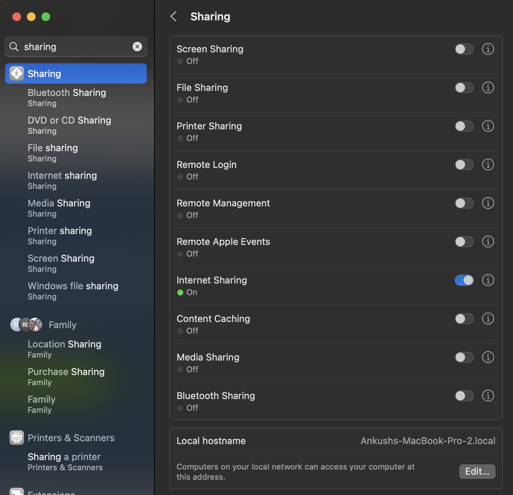
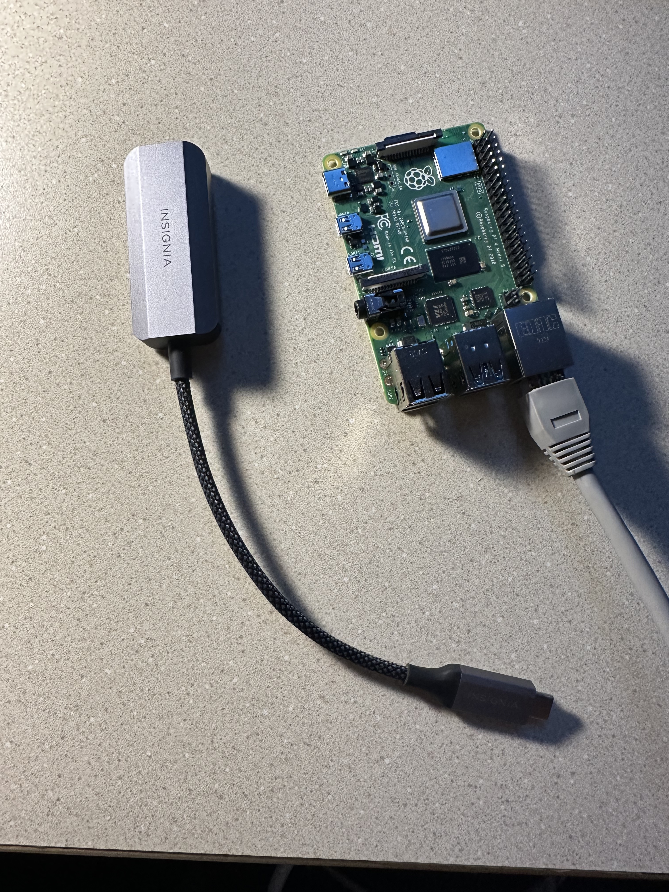

Lab 8: Seeing is Believing
========================

Give Pupper the ability to see! In this lab, you'll be using Pupper's OAK-D camera to recognize and track a person (in place).

`Lab Document <https://docs.google.com/document/d/1E9m5CkxJx1agDqbwgxrIn9BYTjTdWUYTpshVoe7uvxg/edit?usp=sharing>`_ 

`Lab Review Slides <https://docs.google.com/presentation/d/1a1IG7vqRjBscTM1JT7yWsLgEbjuSJ4uk/edit?usp=sharing&ouid=106128192400488507549&rtpof=true&sd=true>`_ 

**Goals:**
        1. Use computer vision to detect people.
        2. Program pupper to track people in place using bounding boxes.

Step 0. Flash software image with vision dependencies onto Raspberry Pi
^^^^^^^^^^^^^^^^^^^^^^^^^^^^^^^^^^^^^^^^^^^^^^^^^^^^^^^^^^^^^^^^^^^^^^
#. Download the `pupper_vision.iso image <https://drive.google.com/file/d/1AE6p09rVYqrKcIkyFl45AEo0zhFC5BbI/view?usp=sharing>`_
#. Install `Balena etcher <https://www.balena.io/etcher/>`_
#. Flash the image onto the micro SD card using Balena etcher. 
#. Insert the micro sd card into the Pi's micro sd card slot (on bottom side of board)

Step 1. SSH into the Pupper
^^^^^^^^^^^^^^^^^^^^^^^^^^^^^^^^^^^^^^^^^^^^

#. Before starting the SSH, share network between your host machine and its remotes. In System Preferences, open "Sharing". In this window, you should see "Internet Sharing". Expand the options there, and enable all LAN connections so that we can share network over the ethernet connection to the Raspberry Pi. Turn on Internet Sharing. 
#. With the fully built Pupper, plug an ethernet cable between your laptop and the Pupper's Raspberry Pi, using an ethernet to usb adapter if needed (provided, ask a TA).  

#. Like the RL lab, we can SSH into a remote system inside VSCode. Open VSCode, and use ``CMD + Shift + P`` to access the Command Pallete.
#. In the Command Pallette, type in ``pi@raspberrypi.local`` to prompt a remote connection. This will allow you to ssh into the Pupper's Raspberry Pi via the ethernet connection. 
#. When the Enter Password prompt shows, enter ``raspberry`` as the password. This is a default password on the Raspberry Pis, you may change it if you like (be sure to remember it!). VSCode will tell you if your SSH connection was successful. You can use the Command Pallete to navigate around the Raspberry Pi and use the Terminal to run commands. 

Step 2. Clone the starter code
^^^^^^^^^^^^^^^^^^^^^^^^^^^^^^^^^^^^^^^^^^^^
#. For this lab, the code will run directly on your Pupper, which is why we have to SSH into the Raspberry Pi. Once SSH'd create a new directory for CS123 under home, and ``cd`` into it, and clone the lab 7 starter code. Install the package prequisites.

``mkdir ~/CS123``

``cd CS123``

``git clone https://github.com/cs123-stanford/lab_8_seeing_is_believing.git``

Step 3. Edit vision.py to determine where the Pupper should be looking
^^^^^^^^^^^^^^^^^^^^^^^^^^^^^^^^^^^^^^^^^^^^
#. In this section, you guys will be working with bounding boxes. Bounding boxes are rectangles surrounding an individual detection that indicate the size and position of an object in the image. Each bounding box is stored in the ``detections`` array, and you can pull out each individual detection by iterating through it.
#. Add a print statement to view the outputs of the ``detections`` variable. 
#. Filter the detections so they only include the "person" class. You can get the text representation of the label like this: ``labelMap[detection.label]``.
#. Find the x center of the bounding box around the person using ``detection.xmin`` and  ``detection.xmax``.
#. Find how far the x center of the person is from where the Pupper is currently pointing (Pupper's field of view is a rectangle normalized to have lengths and widths of 1)
#. Use KP (you can start with a KP of 1.0) to implement a proportional controller to determine yaw_rate.
#. Fill in the contents of the send_velocity_command function. This should take a single number (the rate at which Pupper should turn) and write it to a file so it can be accessed by the control.py script. You should be using the ``open()`` and ``.write()`` functions 

Step 4. Edit control.py to update Pupper's velocity
^^^^^^^^^^^^^^^^^^^^^^^^^^^^^^^^^^^^^^^^^^^^
#. In this step, write code to read from the velocity_command file and determine what Pupper's yaw rate should be. You will need to use ``open()`` and ``readline()`` functions.
#. Once this is done, the ``pup.step`` function will command Pupper to move according to the desired yaw rates. 

Step 5. Run your code on Pupper!
^^^^^^^^^^^^^^^^^^^^^^^^^^^^^^^^^^^^^^^^^^^^
#. Open two terminal windows, and SSH into Pupper in both.
#. Use ``scp`` to copy your files into the raspberry with the command
``scp -r lab_8_filepath pi@raspberrypi.local:~``
#. In the first window, run the vision script (``python3 vision.py``)
#. In the second window, run the control script (``python3 control.py``)
#. Pupper should turn to track you when you stand in front of the camera. Experiment with different values of ``KP`` to see how they affect Pupper's behavior.
